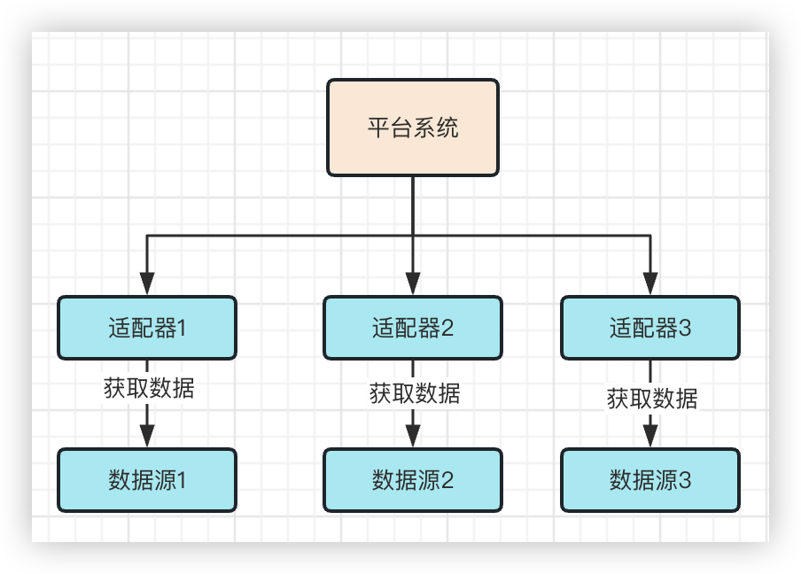
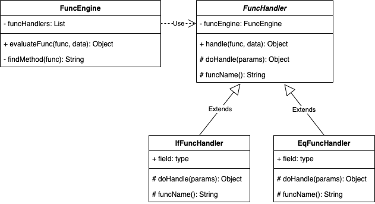

# 函数引擎组件

## 前言

项目里存在一个这样的系统，它的主要功能类似于适配器，将一个系统的异构数据进行转化，处理成标准的数据流，交给另一个平台系统。

当然，也可以反过来理解，有一个平台级系统，需要从多种数据源（系统）中采集数据，每种数据源的数据结构都不相同，需要有个中间人进行转化。这个系统就承担了这样的角色。



这样的架构虽然降低了平台系统的复杂度，使每个适配器只专注于某一个数据源的对接。但由于平台系统从数据源获取数据是通过HTTP请求的方式完成的，一般来说可能涉及十几到几十个接口的对接。所以适配器的内部转化逻辑的代码编写也存在较大的工作量。

而每个适配器的转化逻辑大致是相同的，主要有几个方面：

- 字段名称转化：如将数据源的name字段转化为平台的username
- 枚举转化：男转化为M, 女转化为F
- 数据层级转化：平台的数据结构为user.username, 数据源的数据结构为user.base.username, username字段所在的层级不同
- 数据结构转化：平台的数据结构为对象，数据源的数据结构为数组

> 当然还有很多等等等等，不再列举

## 思路

为了解决以上的问题，我的想法是借鉴类Excel的方式，由于平台的数据结构是确定的，那么我只要编写一定的函数，将数据源的数据结构配置起来，系统通过解析配置的方式进行数据转化，比如

```properties
name=#username
sex=if(eq(#gender,'男')，'M', 'F')
user.username=#user.base.username
```

> #代表取值 .表示层级 如{ user: { name: “张三”}}写作user.name
>
> if(true of false, 真时的返回值，假时的返回值)
>
> eq(value1, value2), 判断value1和value2是否相等，返回boolean值
>
> if(eq(#sex,'男')，'M', 'F')： 当#gender为男时返回M,否则返回F

于是我遇到了我面临的第一个问题，也是本篇文章的主要内容：应该如何解析这串表达式`if(eq(#gender,'男')，'M', 'F')`

## 设计

`if(eq(#gender,'男')，'M', 'F')`这样的表达式有很多框架都能解析，如Spel、JEP。

我虽然不知道他们怎么实现的，但我也有自己的想法。

让我们逐一来分析这个表达式的特性

1、表达式由多个函数`嵌套`组成

2、函数的格式为`函数名(参数，参数，…)`

3、不同的函数`参数个数不同`

4、不同的函数`逻辑不同`

得出：

1、多个函数&&逻辑不同：使用策略模式，每个函数一个类，使用策略的方式调度每一个函数

2、嵌套：凡嵌套，必递归

3、函数格式固定：通过模板方法统一解析

4、参数个数不同：使用集合保存所有参数

134点还比较简单，递归一般是难点，这里单独讲一下：

递归递归，有递有归，何时递何时归？

拿这个表达式分析`if(eq(#gender,'男')，'M', 'F')`：

1、凡是遇到了函数(if, eq)，就需要递

2、其他的如`#`|`'男'`就归

整个表达式的执行流程为：

1、先遇到`if`，取出里面的3个参数

2、发现第一个参数是个函数`eq`, 执行`eq`逻辑

3、`eq`中无嵌套函数，返回执行结果

4、继续判断`if`的参数，第二三参数非函数，执行`if`逻辑


整体UML图：



>FuncHandler: 函数处理器，抽象类，公共的handler方法，实现解析参数，递归过程等通用流程;抽象的doHandler方法，交由子类实现函数的特定逻辑;funcName方法，获取函数名称，如`if`
>
>IfFuncHandler | EqFuncHandler: 子类，实现特定的函数逻辑
>
>FuncEngine: 函数引擎，调度各类函数

## 代码

这里要先解决个小问题，如何得到函数中的所有参数？

假设函数是`eq(#gender, '男')`, 那只要

```java
String func = "eq(#gender,'男')";
// 得到#gender,'男'
func = func.subString("eq".length() + 1, func.lastIndexOf(')'));
// 分割
String[] params = func.split(',');
```

但如果是`if(eq(#gender,'男')，'M', 'F')`，就会发现最后分割出来的参数列表是错误的。

这里的关键点在于`不能分割嵌套函数的逗号`,也就是`eq(#gender, '男')`中的逗号

一道简单的算法题：如何判断字符串中的括号是否成对，比如`((()))`和`(()())`是成对的，`(()))`不是成对的

```java
String str = "((()))";
int count = 0;
for(char c, str.toCharArray()){
  if(c == '('){
    count ++;
  }else {
    count --
  }
}
// count等于0即成对
```

所以我们判断函数中的某个逗号是否能分割，关键在于判断该逗号是否在嵌套函数内，也就是括号是否成对(`count==0`), 如果`count!=0`,说明此括号在函数内，不能分割。代码如下

```java
protected List<String> extractParameters(String func, String funcName) {
    // 去除两边的括号，得到函数内的字符串
    String content = func.substring(funcName.length() + 1, func.lastIndexOf(')'));
    // 保存参数的集合
    List<String> parameters = new ArrayList<>();
    // 参数起始下标，括号计数
    int parameterStartIndex = 0, parenthesisCount = 0;

    for (int i = 0; i < content.length(); i++) {
        char ch = content.charAt(i);
        if (ch == '(') {
            parenthesisCount++;
        } else if (ch == ')') {
            parenthesisCount--;
        } else if (ch == ',' && parenthesisCount == 0) {
            // 当遇到逗号，且括号成对，说明逗号不在嵌套函数内，记录该参数
            parameters.add(content.substring(parameterStartIndex, i));
            // 修改起始值
            parameterStartIndex = i + 1;
        }
    }
    // 保存最后一个的参数
    parameters.add(content.substring(parameterStartIndex));

    return parameters;
}
```

这个小问题解决后，我们看一下`FuncHandler`的整体代码

`FuncHandler`代码实现如下：

```java
public abstract class FuncHandler {

    @Autowired
    protected FuncEngine funcEngine;


    public Object handle(String func, JSONObject data) {
        // 获取函数中的参数
        final List<String> parameters = extractParameters(getFuncLen(), func);
        List<Object> evaluateResult = new ArrayList<>(parameters.size());
        for (String parameter : parameters) {
            // 继续递归执行每个参数(参数可能是个函数) 重要！！
            Object val = funcEngine.evaluateFunc(parameter, data);
            // 保存结果
            evaluateResult.add(val);
        }
        // 调用子类函数
        return doHandle(evaluateResult);
    }

    /**
     * 提取参数集合
     *
     * @param openParenthesisIndex 左括号下标，函数名的长度就是左括号的下标位置
     * @param func           当前函数
     * @return 参数集合
     */
    protected List<String> extractParameters(int openParenthesisIndex, String func) {
        int closingParenthesisIndex = findClosingParenthesis(func, openParenthesisIndex);
        // 去除两边的括号，得到函数内的字符串
        String content = func.substring(openParenthesisIndex + 1, closingParenthesisIndex);
        // 保存参数的集合
        List<String> parameters = new ArrayList<>();
        // 参数起始下标, 括号计数
        int parameterStartIndex = 0, parenthesisCount = 0;

        for (int i = 0; i < content.length(); i++) {
            char ch = content.charAt(i);
            if (ch == '(') {
                parenthesisCount++;
            } else if (ch == ')') {
                parenthesisCount--;
            } else if (ch == ',' && parenthesisCount == 0) {
                // 当遇到逗号，切括号成对，说明逗号不在嵌套函数内，记录该参数
                parameters.add(content.substring(parameterStartIndex, i));
                // 修改起始值
                parameterStartIndex = i + 1;
            }
        }
        // 保存最后一个的参数
        parameters.add(content.substring(parameterStartIndex));

        return parameters;
    }

  
    /**
     * 每一个函数处理结果方式不同交由子类实现
     *
     * @param params 表达式解析结果集合
     * @return 处理结果
     */
    protected abstract Object doHandle(List<Object> params);

    /**
     * 获取函数名称长度
     *
     * @return 名称长度
     */
    protected int getFuncLen() {
        return funcName().length();
    }

    /**
     * 获取函数名称
     * @return 函数名称
     */
    public abstract String funcName();

}
```

子类实现就比较简单了，只要实现`doHandler`方法，专注于自己的逻辑即可

IfFuncHandler:

```java
@Component
public class IfFuncHandler extends ObjectFuncHandler {

    @Override
    protected Object doHandle(List<Object> params) {
        Boolean booleanValue = (Boolean) params.get(0);
        if (Boolean.TRUE.equals(booleanValue)) {
            return params.get(1);
        }
        return params.get(2);
    }

    /**
     * IF(boolean,five,other)
     */
    @Override
    public String funcName() {
        return "IF";
    }
}
```

EqFuncHandler

```java
@Component
public class EqFuncHandler extends ObjectFuncHandler {

    @Override
    protected Object doHandle(List<Object> params) {
        return ObjectUtil.equal(params.get(0).toString(), params.get(1).toString());
    }

    /**
     * EQ(#age,10)
     */
    @Override
    public String funcName() {
        return "EQ";
    }

}
```

## 调度

接下来是`FuncEngine`的实现。

想要通过`FuncEngine`调度所有函数，首先我们需要先将每个函数进行注册，这个可以通过Spring的依赖注入功能实现

```java
@Resource
private List<FuncHandler> handlers;
```

> 像这样写，Spring即会将FuncHandler的所有子类注入到List中

其次我们还要注册一份函数表，用于通过函数名找到对应的函数bean

```java
private static final Map<String, FuncHandler> HANDLER_MAP = new HashMap<>();
```

这个可以利用Spring的初始化功能，实现`InitializingBean`接口或者使用`@PostConstruct`注解

```java
@Override
public void afterPropertiesSet() {
    for (FuncHandler handler : handlers) {
        HANDLER_MAP.put(handler.funcName().toLowerCase(Locale.ROOT), handler);
    }
}
```

最后就是调度

```java
public Object evaluateFunc(String func, JSONObject data) {
    final FuncHandler funcHandler = HANDLER_MAP.get(findMethod(func));
    if (funcHandler != null) {
        return funcHandler.handle(func, data);
    }
    if(func.startsWith("#")){
        // 截取掉#
        return data.get(func.substring(1));
    }
    if(func.startsWith("'") && func.endsWith("'")){
        return func.substring(1, func.length()-1);
    }
    return func;
}
public String findMethod(String func) {
    final int i = func.indexOf('(');
    if (i > 0) {
        return func.substring(0, i).toLowerCase(Locale.ROOT);
    }
    return null;
}
```

完整代码

```java
@Component
public class FuncEngine implements InitializingBean {
  	@Resource
		private List<FuncHandler> handlers;
  
  	private static final Map<String, FuncHandler> HANDLER_MAP = new HashMap<>();
  
    public Object evaluateFunc(String func, JSONObject data) {
        // 去除两边的空格
        func = func.trim();
        // 获取funcHandler
        final FuncHandler funcHandler = HANDLER_MAP.get(findMethod(func));
        if (funcHandler != null) {
            return funcHandler.handle(func, data);
        }
        // 是否从json取值
        if(func.startsWith("#")){
            // 截取掉#
            return data.get(func.substring(1));
        }
        // 去除单引号
        if(func.startsWith("'") && func.endsWith("'")){
            return func.substring(1, func.length()-1);
        }
        return func;
  	}
  
  	public String findMethod(String func) {
        final int i = func.indexOf('(');
        if (i > 0) {
            return func.substring(0, i).toLowerCase(Locale.ROOT);
        }
        return null;
    }
  
    @Override
    public void afterPropertiesSet() {
        for (FuncHandler handler : handlers) {
            HANDLER_MAP.put(handler.funcName().toLowerCase(Locale.ROOT), handler);
        }
    }
}
```

## 使用方式

1、引入依赖

```xml
<dependency>
  <groupId>com.kqinfo</groupId>
  <artifactId>kq-universal-func-starter</artifactId>
  <version>?</version>
</dependency>
```

2、使用

```java
@SpringBootTest
public class SimpleTest {

    @Resource
    private FuncEngine funcEngine;

    @Test
    public void testExpress(){
        String expression = "IF(GTE(#age,18), '成人', IF(LT(#age,12), '儿童','青少年'))";
        {
            String jsonData = "{ \"age\": 9, \"name\": \"zhangsan\" }";
            JSONObject data = JSON.parseObject(jsonData);
            Assertions.assertEquals("儿童", funcEngine.evaluateFunc(expression, data));
        }
        {
            String jsonData = "{ \"age\": 18, \"name\": \"zhangsan\" }";
            JSONObject data = JSON.parseObject(jsonData);
            Assertions.assertEquals("成人", funcEngine.evaluateFunc(expression, data));
        }
    }
}
```

3、获取所有函数信息

```java
funcEngine.expressionInterpretation();
```

4、实现新的函数

继承 [ObjectFuncHandler.java](src/main/java/com/kqinfo/universal/func/core/handler/abs/ObjectFuncHandler.java) 或 [ArrayFuncHandler.java](src/main/java/com/kqinfo/universal/func/core/handler/abs/ArrayFuncHandler.java) 实现`doHandler`方法

5、多层json获取内层数据

格式：#parent.chlid.chlid.xxxx

```java
  @Test
  public void testDeep(){
      String expression = "DATE(#user.birth,'yyyy-MM-dd')";
      String jsonData = "{\"user\": { \"birth\": \"2023年02月02日\", \"name\": \"zhangsan\" }}";
      JSONObject data = JSON.parseObject(jsonData);
      ExpressionData expressionData = new ExpressionData(expression, data, 0);
      final Object o = expressionEngine.evaluateExpression(expressionData);
      Assertions.assertEquals("2023-02-02", o.toString());
  }
```

